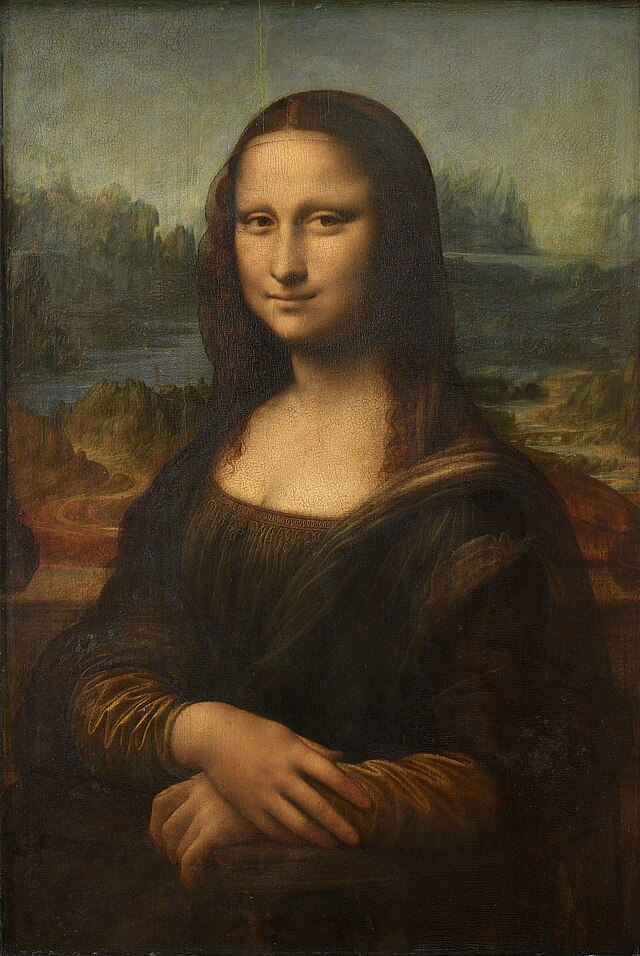
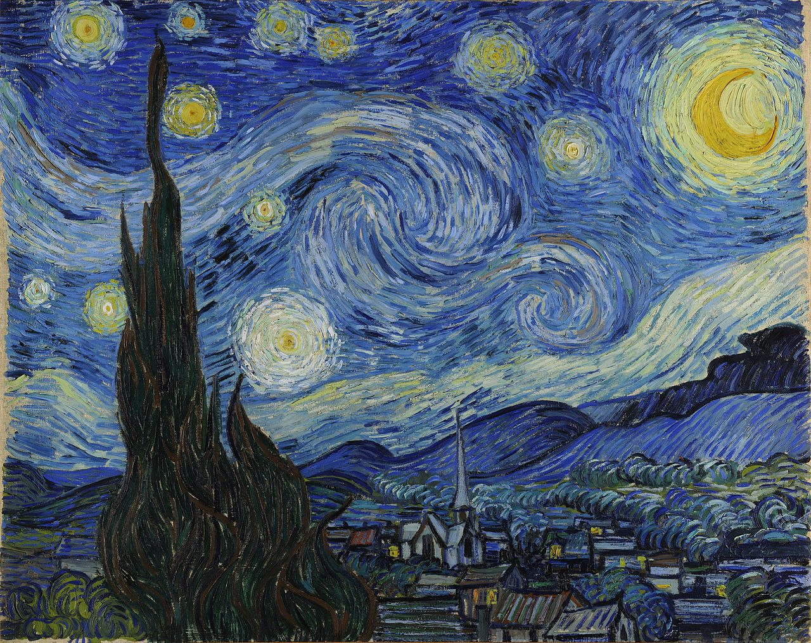

# Neural_Style_Transfer

## Introduction
This is a PyTorch implementation of the paper [A Neural Algorithm of Artistic Style](https://arxiv.org/abs/1508.06576) by Leon A. Gatys, Alexander S. Ecker, and Matthias Bethge.

## Results
| Content Image | Style Image | Output Image |
| :---: | :---: | :---: |
|  |  |  |
|  |  |  |
|  |  |  |
|  |  |  |

